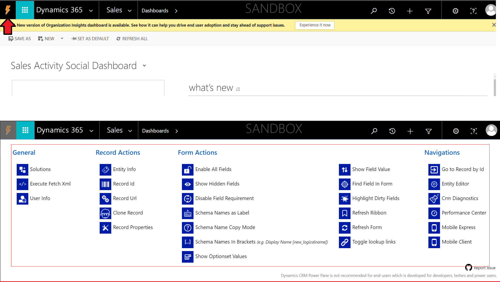

# CRM Power Pane

The CRM Power Pane is a helper tool designed to integrate with Microsoft Dynamics 365 application and allow you to manipulate forms or perform actions faster throughout the Microsoft Dynamics 365 application.

## Usage
Click the CRM Power Pane icon next to the Microsoft Dynamics 365 logo, and select your action.

## Install

### Google Chrome

### Mozilla Firefox

*Disclaimer: This is as unsupported as it gets.*

## Build and Run

To build the repository, you need to have Node.js and `npm` installed.

1. Clone the repository
2. Run `npm install` to install the dependencies
3. Run `npm run build-chrome` to build for Google Chrome.
4. Run `npm run build-firefox` to build for Mozilla Firefox.
5. Run `npm run build-edge` to build for Microsoft Edge (experimental).

The extensions will be built under `./dist/chrome/`, `./dist/firefox/` and `./dist/edge/` directories respectively.

## Contribute

Simply fork the repository, make your change, test it and send a pull request! 

We will review each pull request and include them in the next release. All contributions are welcome.
